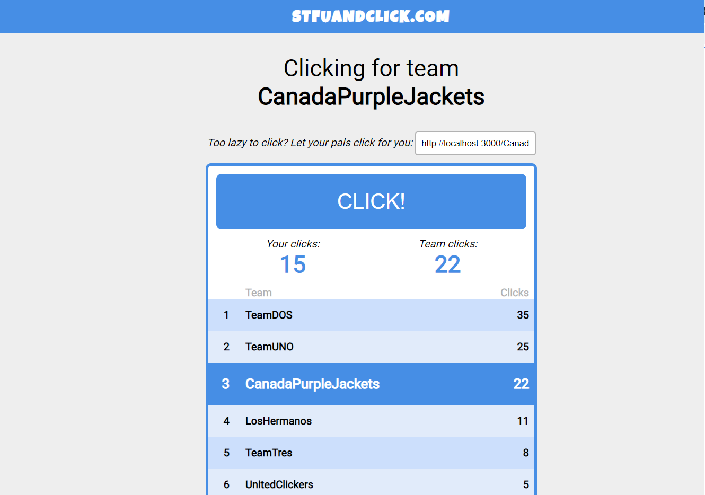

Full-Stack Click Application
=========================

### **Technologies used**:
  #### Front-end:
  - SCSS
  - Typescript
  - React
  - Redux Toolkit
  
  #### Back-end:
  - Typescript
  - Node.js
  - Express
  - MongoDB
  - Zod
  - Jest & Superset

### **Used practices and implemented features***:
  - the homepage displays an input where the user can type a team name which he wants to create or join
    - the team is created if it doesn't exist
    - the team is going to be updated if it exists
  - the leaderboard displays the top 10 teams sorted by total number of clicks
  - the leaderboard is updated on EVERY action made by the current user
  - the team page allows the user to click for the selected team
  - the team page displays TWO numbers: 'Your clicks' ( representing user's clicks for current team ) and 'Total clicks' ( representing the aggregated number of clicks on the current team)  
  - each user is identified by an uuid generated on the first page load, then it is going to be stored in the LocalStorage
  - users can create or join any team
  - routes for handling the data stored in DB
  - unit testing with Jest
    - used Supertest library in order to write tests for routes
  - split code in models ( interfaces ), handlers, routes and tests 
  - added middleware for:
    - request validation -> used a general and scalable function named `validateRequest` which acts like a schema validation and it receives as parameter an object including the desired verification ( e.g: validateRequest({ body: Team }) will check if the body has `Team` type )
    - not found routes
  - integrated Helmet.js which secures the app by setting various HTTP headers
  - stored DB credentials in .env
