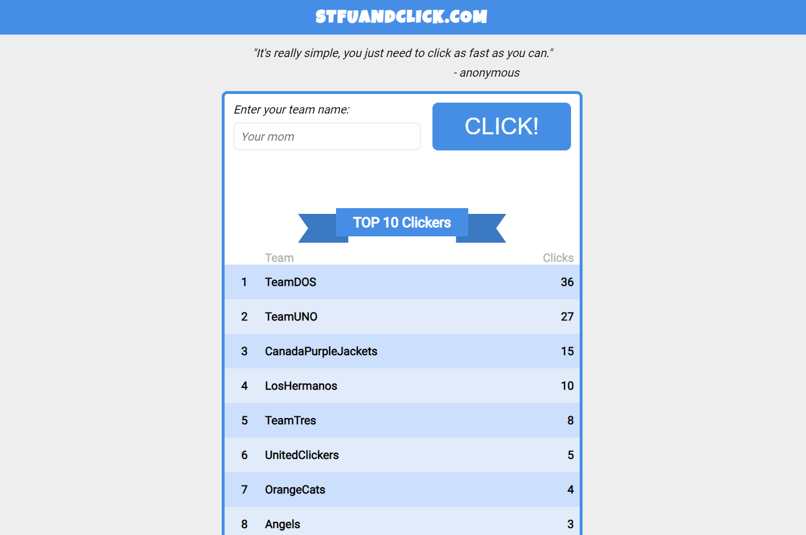

Full-Stack Click Application
=========================

### **Technologies used**:
  #### Front-end:
  - SCSS
  - Typescript
  - React
  - Redux Toolkit
  
  #### Back-end:
  - Typescript
  - Node.js
  - Express
  - MongoDB
  - Zod
  - Jest & Superset

Used practices and implemented features:
  - routes for handling the data stored in DB
  - unit testing with Jest
    - used Supertest library in order to write tests for routes
  - split code in models ( interfaces ), handlers, routes and tests 
  - added middleware for:
  - request validation -> used a general and scalable function named `validateRequest` which acts like a schema validation and it receives as parameter an object including the desired verification ( e.g: validateRequest({ body: Team }) will check if the body has `Team` type )
  - not found routes
  - integrated Helmet.js which secures the app by setting various HTTP headers
  - stored DB credentials in .env
